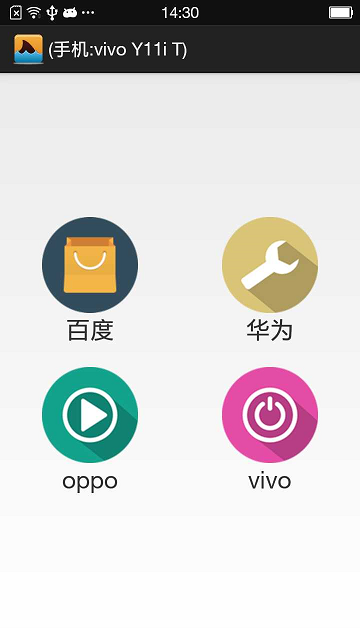
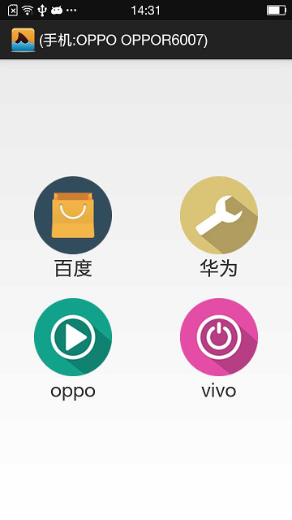
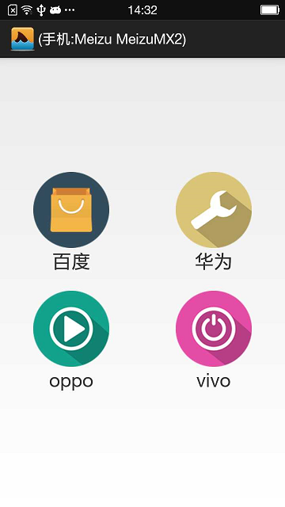

# 这个机器本身是一个中兴V5s手机 
# 看我是不是可以随意更改手机机型厂商
现在U点的项目，点击百度的按钮可以更改成任意机型手机，点击华为、oppo、vivo分别更改成对应手机机型。

## 该软件名称叫U点，可以实现什么功能呢？
* 可以随意修改手机机型、厂商、IMEI、屏幕宽高、IP、已连接WIFI名称等等，只要你想到的都能修改

## 如何实现的呢？
* 当然是使用非常强大的Xposed框架，可以拦截任何你想要修改的方法

## 主要实现代码
* com.unking.xposedpoint.xposed.XposedManager

## 讲解如果运用安装改项目
下载相应配置文件，请去我的百度网盘下载
https://pan.baidu.com/s/1q0uo-ZiHzjRSeZNzsYmq5g
提取码：cosu

* 准备一台中兴 V5s手机，并且ROOT，如果没有ROOT，请自行去软件市场下载一个【360超级ROOT】或者【kingroot】10秒搞定root
* 将百度网盘里面的xposed.installer.apk安装到手机上，安装完成后，打开Xposed Installer-->点击 框架-->点击 安装/更新，然后按照提示重启手机
* 将百度网盘里面的point文件夹复制到手机SD卡根目录下
* 将百度网络里面的UPoint.apk或者通过源码打包的U点项目安装到手机，打开Xposed Installer，点击模块，在里面就会看见U点，勾选上然后重启手机
* 手机重启成功，打开U点，就可以随意切换手机机型了【注：第一次点击安装切换，可能会卡主，请等待，此时正在加载数据】

* 如果想验证手机型号是否切换成功，可以将百度网盘里面的【查看手机信息.apk】安装到手机上，点击打开查看 *
